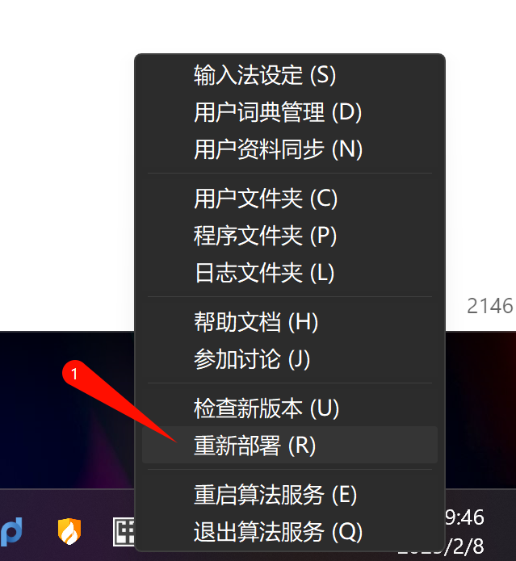
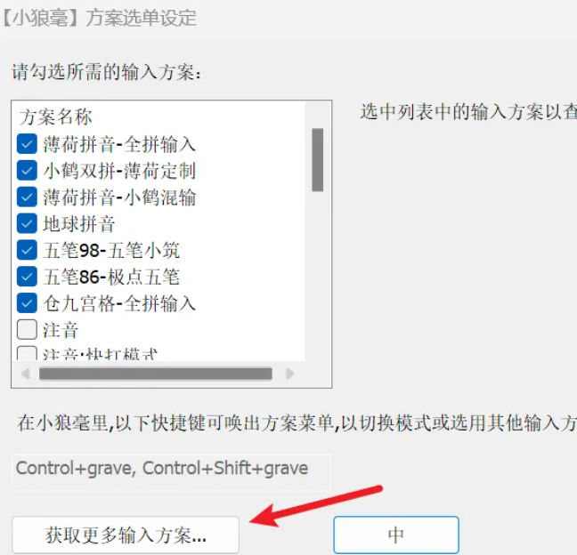
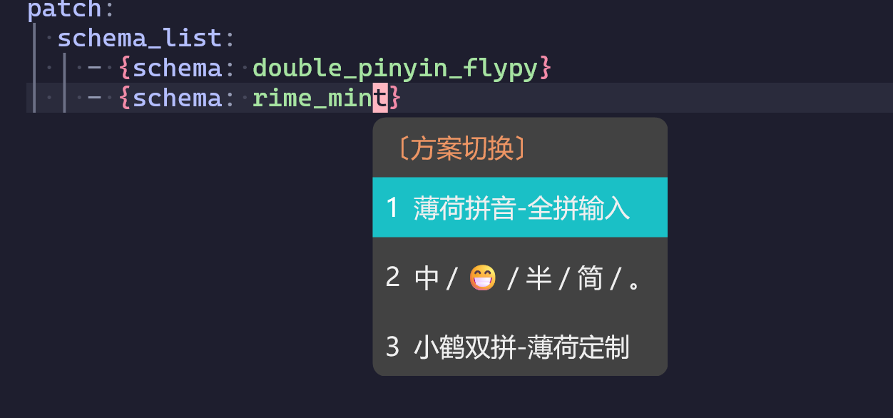
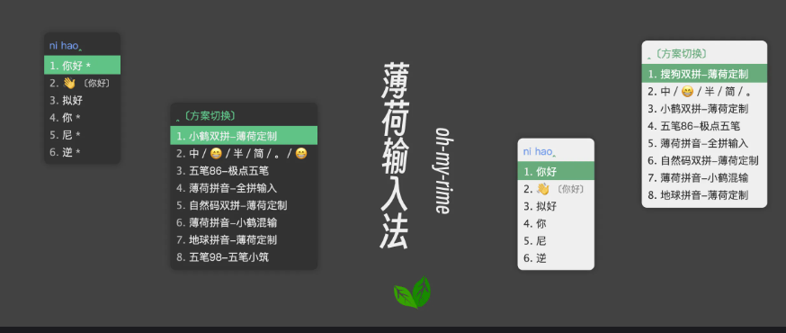
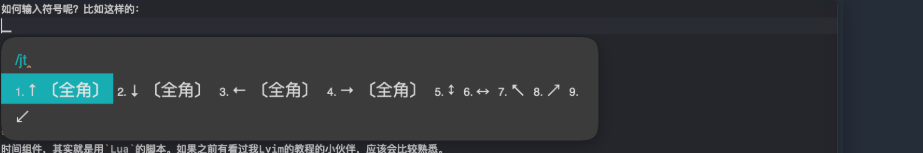
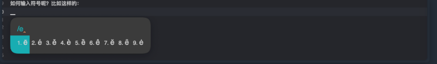
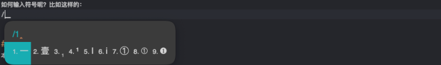

# 

terminal下载：
- [GitHub - microsoft/terminal: The new Windows Terminal and the original Windows console host, all in the same place!](https://github.com/microsoft/terminal)

powershell下载：

- [GitHub - PowerShell/PowerShell: PowerShell for every system!](https://github.com/PowerShell/PowerShell)

NerdFont下载：

- [Nerd Fonts - Iconic font aggregator, glyphs/icons collection, & fonts patcher](https://www.nerdfonts.com/font-downloads)

starship下载：

- [GitHub - starship/starship: ☄🌌️ The minimal, blazing-fast, and infinitely customizable prompt for any shell!](https://github.com/starship/starship)

fastfetch下载：
- [Title Unavailable \| Site Unreachable](https://github.com/fastfetch-cli/fastfetch/)
- `scoop install fastfetch`

nushell下载

- `scoop install nu`

neovim下载：

- [https://github.com/neovim/neovim/blob/master/INSTALL.md](https://github.com/neovim/neovim/blob/master/INSTALL.md)

neovide下载：

- [https://neovide.dev/](https://neovide.dev/)

Zoxide  目录跳转

- https://github.com/ajeetdsouza/zoxide

# 1. powershell设置


如果是win11的话会自带terminal，我是给卸载了，【设置->应用->安装的应用】


```lua
set-ExecutionPolicy RemoteSigned

# 安装Terminal-Icons
Install-Module -Name Terminal-Icons -Repository PSGallery

# 安装显示Git状态汇总信息
Install-Module posh-git -Scope CurrentUser

# 补全
Install-Module PSReadLine -Force

#文件搜索
Install-Module -Name PSFzf

# Directory jumper
Install-Module -Name z
```

#### 代理

现在，你可以在 PowerShell 中使用以下命令：

- 输入 `proxy` 来启用代理
- 输入 `unproxy` 来禁用代理
- 输入 `check-proxy` 来查看当前的代理设置

> 1. 这个设置只影响当前的 PowerShell 会话，不会影响其他应用程序或系统级的代理设置。
> 2. 如果你的代理地址和端口不是 `127.0.0.1:7890`，请相应地修改函数中的 URL。

#### 添加右键菜单

1. 打开注册表编辑器（`regedit`）。

2. 导航到以下路径：

   ```
   HKEY_CLASSES_ROOT\Directory\Background\shell
   ```

   这个路径用于添加右键菜单到文件夹背景。如果你想添加到文件夹本身，可以导航到：

   ```
   HKEY_CLASSES_ROOT\Directory\shell
   ```

3. 在 `shell` 键下，右键点击空白处，选择“新建” > “项”，命名为 `WindowsTerminal`（或者你想要的名称）。

4. 在新建的 `WindowsTerminal` 项中，右键点击空白处，选择“新建” > “项”，命名为 `command`。

5. 在 `command` 项中，双击右侧窗口中的 `(默认)` 值，输入以下内容：

   ```
   "C:\Apps\WindowsTerminal\WindowsTerminal.exe" --profile "默认配置文件名称" --new-tab -d "%V"
   ```

   - 将 `C:\Apps\WindowsTerminal\WindowsTerminal.exe` 替换为你的 Windows Terminal 的实际路径。
   - 如果你没有指定默认配置文件名称，可以省略 `--profile "默认配置文件名称"` 部分。
   - `-d "%V"` 表示在当前文件夹路径下打开终端。

6. 返回到 `WindowsTerminal` 项，双击右侧窗口中的 `(默认)` 值，输入你希望在右键菜单中显示的名称，例如 `在终端中打开`。

#### **添加图标（可选）**

如果你想为右键菜单项添加图标，可以进行以下操作：

1. 在 `WindowsTerminal` 项中，右键点击空白处，选择“新建” > “字符串值”，命名为 `Icon`。

2. 双击 `Icon`，输入 Windows Terminal 的图标路径，例如：

   ```
   "C:\Apps\WindowsTerminal\WindowsTerminal.exe,0"
   ```

   这里的 `,0` 表示使用该程序的第一个图标。

# 2. starship配置

```lua
mkdir ~/.cache/starship
starship init nu | save -f ~/.cache/starship/init.nu
```

路径：`~/.config/starship.toml`
starship 的所有配置都在此 [TOML](https://github.com/toml-lang/toml) 文件中完成

> 我这里保持默认就行，不做配置


# 3. yazi

[installation|Yazi](https://yazi-rs.github.io/docs/installation)


在powershell配置文件中加入如下内容：
```bash
function y {  
$tmp = [System.IO.Path]::GetTempFileName()  
yazi $args --cwd-file="$tmp"  
$cwd = Get-Content -Path $tmp -Encoding UTF8  
if (-not [String]::IsNullOrEmpty($cwd) -and $cwd -ne $PWD.Path) {  
Set-Location -LiteralPath ([System.IO.Path]::GetFullPath($cwd))  
}  
Remove-Item -Path $tmp  
}
```
然后就可以使用`y`而不是`yazi`来启动，并按 退出q，

# 4.nushell

路径：`nushell` 中执行 `echo $nu.config-path`

示例配置：

```lua
# 启动starship
use ~/.cache/starship/init.nu

# 删除欢迎语
$env.config.show_banner = false

$env.config.buffer_editor = "nvim"

# 定义别名和目录常量
alias vim = nvim

# 设置代理
# $env.HTTP_PROXY = ""
def --env "proxy set" [] {
    load-env { "HTTP_PROXY": "socks5://127.0.0.1:10808", "HTTPS_PROXY": "socks5://127.0.0.1:10808" }
}

proxy set

def --env "proxy unset" [] {
    load-env { "HTTP_PROXY": "", "HTTPS_PROXY": "" }
}

def "proxy check" [] {
    print "Try to connect to Google..."
    let resp = (curl -I -s --connect-timeout 2 -m 2 -w "%{http_code}" -o /dev/null www.google.com)
    
    if $resp == "200" {
        print "Proxy setup succeeded!"
    } else {
        print "Proxy setup failed!"
    }
}
```


# 5.neovim

配置文件的存放地址：`C:\Users\用户\AppData\Local\nvim`

Lazyvim项目地址：[GitHub - LazyVim/LazyVim: Neovim config for the lazy](https://github.com/LazyVim/LazyVim?tab=readme-ov-file)

Lazyvim安装文档：[Fetching Title#cmv7](http://www.lazyvim.org/installation)


# 6.RIME 输入法

官方最新版本的小狼毫: https://github.com/rime/weasel/releases/latest

默认情况下的配置文件(配置文件存放在配置目录下；如果不存在，可以手动创建)：

| 文件                                                       | 注释                                               |
| ---------------------------------------------------------- | -------------------------------------------------- |
| default.custom.yaml                                        | 核心配置、全局配置                                 |
| squirrel.custom.yaml / weasel.custom.yaml / ibus_rime.yaml | 平台相关配置。样式皮肤，不同软件默认输入法状态等。 |
| <方案标识>.custom.yaml                                     | 输入方案的定制配置                                 |
| <名称>.dict.yaml                                           | 词典                                               |
| custom_phrase.txt                                          | 自定义短语                                         |

**优先级**：输入方案的定制配置  > 核心配置、全局配置 > 系统自带的**default**.yaml


下载配置模板：[薄荷输入法 – Oh-my-rime](https://github.com/Mintimate/oh-my-rime)

该模板特点，已经配置：

- 内置[雾凇拼音](https://github.com/iDvel/rime-ice)词典，并且仓库内的字典与雾凇拼音同步；
- 已经配置好了水鸭青皮肤样式配置；
- 内置三款输入法： 薄荷拼音（全拼）、地球拼音-薄荷定制和五笔98薄荷定制，方便不同小伙伴选择自己喜欢的输入方式；
- 配置多款`lua`脚本： 支持输入`R`后输入数字，进行数字转换，支持输入`week`、`date`、`time`和`lunar`分别输入当前星期、日期、时间以及农历日期，以词定字等。
- 支持中英混合输入、支持emoji输入、支持繁体输入等。

只需要下载并移动文件到配置目录（用户文件夹），重新部署即可：



详细的配置，可以查看：

- [薄荷输入法 Oh-my-rime 官方文档: https://www.mintimate.cc](https://www.mintimate.cc/)


通过东风破导入薄荷输入配置。东风破的前置条件：

- 已经安装好 Git，并且配置到环境变量内；

如果你是Windows用户，其实小狼毫已经自带一个半成品的东风破，你可以在小狼毫的`方案选单设定`中的`获取更多输入方案`内激活东风破：



之后，在这个界面内，输入薄荷的配方：

```
Mintimate/oh-my-rime:plum/full
```


### 方案切换

使用热键进行方案切换，热键默认是`Ctrl + ~`或`F4`：

其中`F4`比较容易冲突，那么可以进行修改.
直接配置`default.custom.yaml`里的`hotkeys`

```yaml
"switcher/hotkeys":
  - "Control+grave"
```



### 配色样式

`weasel.custom.yaml`只需要添加

```yaml
patch:
  "style/color_scheme": mint_dark_green
  
  "style/horizontal": true #横向显示
  "us_keyboard_layout": true
  "style/display_tray_icon": true
  "style/font_face": "PingFang"
  "style/font_point": 10
  "style/label_font_point": 6 # 候选词数字大小
  "style/inline_preedit": false # 内嵌预编辑
  "style/corner_radius": 20 # 窗口圆角半径
  "style/layout/border": 0 # 窗口边界高度，大于圆角半径才有效果
  "style/layout/border_width": 0 # 窗口边界宽度，大于圆角半径才有效果
  "style/layout/candidate_spacing": 12
  "style/layout/hilite_padding": 8
  "style/layout/hilite_spacing": 3
  "style/layout/margin_x": 8
  "style/layout/margin_y": 8
  "style/layout/round_corner": 7
  "style/layout/spacing": 10

```

### 双拼编码自定义


薄荷的默认配置，双拼的候选区编码是有做转换的，比如：小鹤双拼需要拼写`你好`，会出现`nihao`，而不是`nihc`：




创建`double_pinyin_flypy.custom.yaml`文件：

```yaml
# Rime Custom
# encoding: utf-8

patch:
  translator/preedit_format: []
```

之后，重新部署输入法，就可以看到双拼的编码了。


### 输入符号

default.custom.yaml

```yaml
patch:
  punctuator/import_preset: symbols
  recognizer/patterns/punct: '^/([0-9]0?|[A-Za-z]+)$'
```







